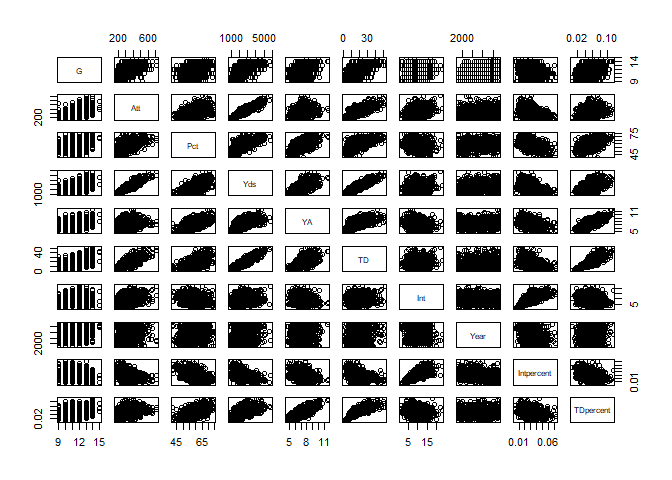
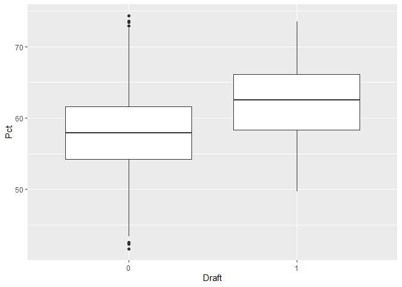
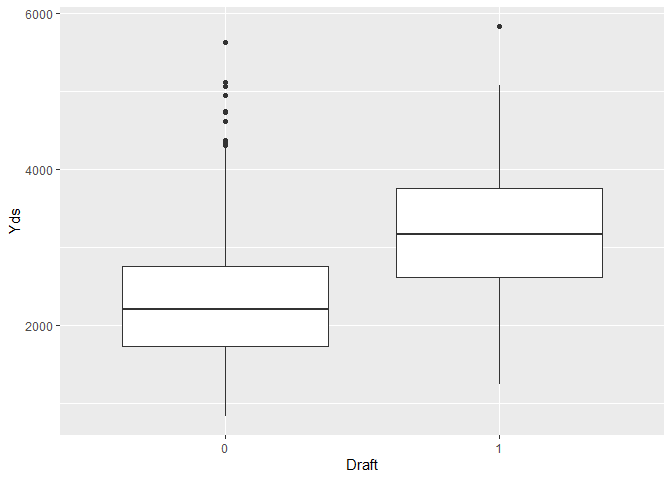
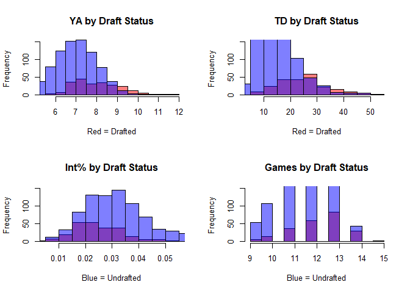
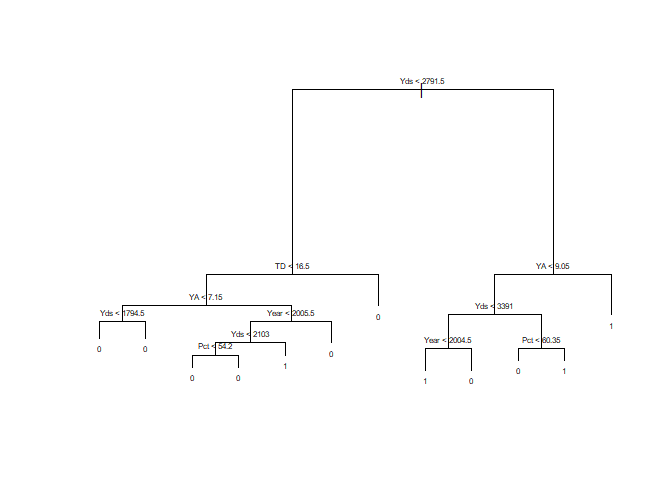
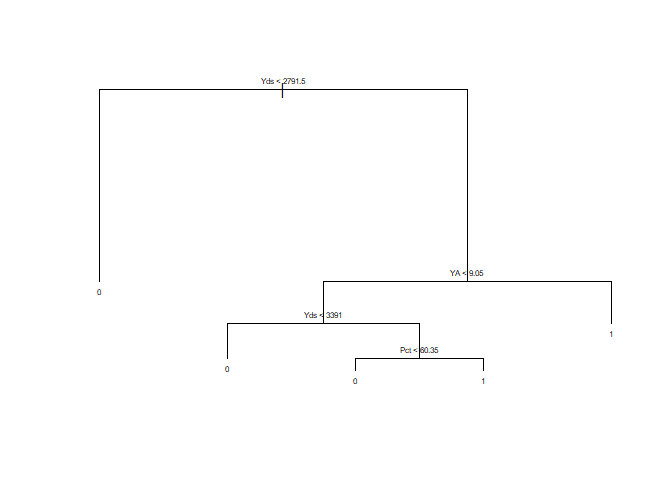
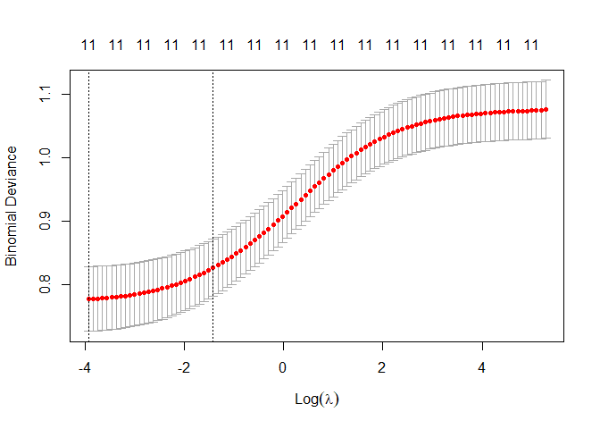
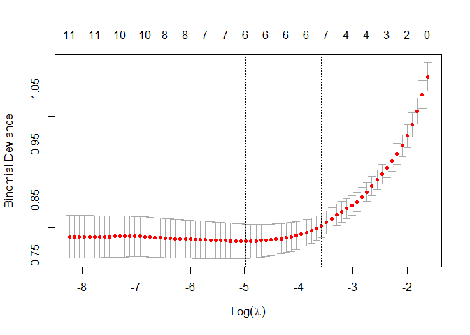

Introduction
============

The NFL draft is an annual event that gives professional football teams the opportunity to improve their roster by recruiting the college football players whom they consider the most talented. The NFL draft is a large event with great media attention, including people whose fame arose from being able to project the draft. Being able to know whether you will be drafted or not allows a player to make an educated decision on potentially declaring for the draft. Additionally, agents want to target players that are likely to be drafted, as they will receive a percentage of their NFL salary. Whereas, undrafted players may not produce any value for the agent. If an NFL team knows which players are going to be drafted, they have more information to develop a strategy to maximize their value from the draft. Being able to know if an athlete will be drafted is vital information for players, agents, teams, and the media.

In this project, we apply supervised machine learning techniques to predict the probability collegiate quarterbacks are drafted into the NFL. These techniques are based on classification methods such as decision trees, random forest, bootstrap aggregating, K-Nearest Neighbors, and logistic regression models. Although our focus is on the quarterback position, our methods can ultimately be applied to any other positions as well. The goal of our project is to simply develop a model that can determine the attributes that largely define a player's draft status Overall, the importance behind our project lies in the decision-making since it would help narrow down the players that will have the biggest impact in the NFL upon leaving college.

Data
====

The data was sourced from sports-reference.com, using a quarterback's passing statistics in their final year of Division 1 college football and cross referencing with their draft status. This data is available to use as per the website's sharing policy. The accumulated data consists of 1036 observations with no missing values. In the data, there are a total of 12 predictors variables: 1 categorical and 11 numerical. Not all quarterbacks play the same level of competition and each conference has a varying degree of difficulty. As a proxy for level of difficulty we created an additional predictor: power5. This is a binary variable stating whether a quarterback played in an esteemed conference which typically face more difficult opponents. Over the timespan of our data conferences have realigned so we have assigned the quarterbacks power5 for playing in these conferences: "Big 12","Pac-10","Pac-12" "Big Ten", "ACC", "SEC", and "Big East". Additionally, Notre Dame quarterbacks are determined power5 for playing in particularly esteemed and difficult matches regardless of the school's conference status. Finally, we converted interception and touchdown statistics to a percentage by dividing by the number of passing attempts. This better demonstrates a quarterback's talent than the raw statistic. The data also includes the players' names and schools which serve as identifiers rather than predictors. Our targeted response variable is a binary value of draft status.

    ## [1] 1036   15

    ## Player School   Conf      G    Cmp    Att    Pct    Yds     YA    AYA     TD 
    ##      0      0      0      0      0      0      0      0      0      0      0 
    ##    Int   Rate   Year  Draft 
    ##      0      0      0      0

    ## # A tibble: 2 x 6
    ##   Draft Yards `Completion %`    TD `Yards per attempt` `Passer Rating`
    ##   <dbl> <dbl>          <dbl> <dbl>               <dbl>           <dbl>
    ## 1     0 2298.           57.9  15.8                7.08            127.
    ## 2     1 3213.           62.1  25.0                8.01            145.

Thw table above shows that there is a significant difference in the statistics between undrafted and drafted quarterbacks. This indicates that it may be possible to differentiate which quarterbacks will be drafted.

    ## # A tibble: 15 x 6
    ##    Conf     Yards `Completion %`    TD `Yards per attempt` `% Drafted`
    ##    <chr>    <dbl>          <dbl> <dbl>               <dbl>       <dbl>
    ##  1 ACC      2482.           58.9  16.7                7.29       22.5 
    ##  2 American 2878            60.9  20.6                7.65       17.4 
    ##  3 Big 12   2709.           59.0  19.9                7.45       25.7 
    ##  4 Big East 2274.           58.5  16.6                7.38       27.5 
    ##  5 Big Ten  2441.           59.0  17.7                7.33       30   
    ##  6 Big West 2289.           53.1  19.5                7.12        0   
    ##  7 CUSA     2549.           58.9  18.6                7.23       13.3 
    ##  8 Ind      2440.           56.5  17                  6.93       17.9 
    ##  9 MAC      2430.           58.1  17.3                6.90       12.0 
    ## 10 MWC      2429.           59.4  17.2                7.29       15.8 
    ## 11 Pac-10   2470.           57.0  17.7                7.31       41.8 
    ## 12 Pac-12   3004.           62.7  22.5                7.66       37.5 
    ## 13 SEC      2432.           58.8  17.7                7.55       31.9 
    ## 14 Sun Belt 2333.           59.4  14.6                7.07        3.03
    ## 15 WAC      2456.           58.7  17.3                7.09       15

This table above shows a significant differnce in percent drafted by conference despite similar passing averages. Showing that the difficulty and prestige of a conference strongly affect a quarterbacks chances of being drafted.

    ##                  G     Cmp     Att     Pct     Yds      YA     AYA      TD
    ## G           1.0000  0.5368  0.5311  0.3553  0.5896  0.3868  0.4223  0.5345
    ## Cmp         0.5368  1.0000  0.9661  0.6679  0.9395  0.3693  0.4650  0.7993
    ## Att         0.5311  0.9661  1.0000  0.4674  0.9091  0.2435  0.3415  0.7469
    ## Pct         0.3553  0.6679  0.4674  1.0000  0.6271  0.5957  0.6491  0.5978
    ## Yds         0.5896  0.9395  0.9091  0.6271  1.0000  0.6110  0.6643  0.8917
    ## YA          0.3868  0.3693  0.2435  0.5957  0.6110  1.0000  0.9393  0.6526
    ## AYA         0.4223  0.4650  0.3415  0.6491  0.6643  0.9393  1.0000  0.7434
    ## TD          0.5345  0.7993  0.7469  0.5978  0.8917  0.6526  0.7434  1.0000
    ## Int         0.1193  0.2515  0.3507 -0.1255  0.2119 -0.1632 -0.3544  0.1174
    ## Rate        0.4335  0.5430  0.3869  0.7910  0.6981  0.9266  0.9662  0.7898
    ## Year        0.2880  0.2562  0.2148  0.2847  0.2247  0.1163  0.1875  0.1889
    ## Intpercent -0.2750 -0.4335 -0.3711 -0.4592 -0.4370 -0.3466 -0.6177 -0.4091
    ## TDpercent   0.3640  0.3761  0.2824  0.4992  0.5511  0.7679  0.8301  0.8257
    ##                Int    Rate    Year Intpercent TDpercent
    ## G           0.1193  0.4335  0.2880    -0.2750    0.3640
    ## Cmp         0.2515  0.5430  0.2562    -0.4335    0.3761
    ## Att         0.3507  0.3869  0.2148    -0.3711    0.2824
    ## Pct        -0.1255  0.7910  0.2847    -0.4592    0.4992
    ## Yds         0.2119  0.6981  0.2247    -0.4370    0.5511
    ## YA         -0.1632  0.9266  0.1163    -0.3466    0.7679
    ## AYA        -0.3544  0.9662  0.1875    -0.6177    0.8301
    ## TD          0.1174  0.7898  0.1889    -0.4091    0.8257
    ## Int         1.0000 -0.2323 -0.1202     0.7004   -0.1094
    ## Rate       -0.2323  1.0000  0.2076    -0.5203    0.8572
    ## Year       -0.1202  0.2076  1.0000    -0.2720    0.1116
    ## Intpercent  0.7004 -0.5203 -0.2720     1.0000   -0.3216
    ## TDpercent  -0.1094  0.8572  0.1116    -0.3216    1.0000

Utilizing the correlation function in R, we found that there were issues with multicollinearity. As a result, we excluded Cmp (number of completions), AYA (adjusted yards per attempts), and Rate (passer rating). It is also important to note that although yards has a high correlation rate with attempts and touchdowns, this is due to the nature of the game where more attempts give you the opportunity for more yards, in turn bringing you closer to the endzone. So although these variables are coordinated, they each display a distinct ability representing a quarterback's talent, giving them predictive power. From here on out we simply focus on a total of 10 predictor variables.



    ##                  G     Att     Pct     Yds      YA      TD     Int    Year
    ## G           1.0000  0.5311  0.3553  0.5896  0.3868  0.5345  0.1193  0.2880
    ## Att         0.5311  1.0000  0.4674  0.9091  0.2435  0.7469  0.3507  0.2148
    ## Pct         0.3553  0.4674  1.0000  0.6271  0.5957  0.5978 -0.1255  0.2847
    ## Yds         0.5896  0.9091  0.6271  1.0000  0.6110  0.8917  0.2119  0.2247
    ## YA          0.3868  0.2435  0.5957  0.6110  1.0000  0.6526 -0.1632  0.1163
    ## TD          0.5345  0.7469  0.5978  0.8917  0.6526  1.0000  0.1174  0.1889
    ## Int         0.1193  0.3507 -0.1255  0.2119 -0.1632  0.1174  1.0000 -0.1202
    ## Year        0.2880  0.2148  0.2847  0.2247  0.1163  0.1889 -0.1202  1.0000
    ## Intpercent -0.2750 -0.3711 -0.4592 -0.4370 -0.3466 -0.4091  0.7004 -0.2720
    ## TDpercent   0.3640  0.2824  0.4992  0.5511  0.7679  0.8257 -0.1094  0.1116
    ##            Intpercent TDpercent
    ## G             -0.2750    0.3640
    ## Att           -0.3711    0.2824
    ## Pct           -0.4592    0.4992
    ## Yds           -0.4370    0.5511
    ## YA            -0.3466    0.7679
    ## TD            -0.4091    0.8257
    ## Int            0.7004   -0.1094
    ## Year          -0.2720    0.1116
    ## Intpercent     1.0000   -0.3216
    ## TDpercent     -0.3216    1.0000

These boxplots and histograms all show that drafted quarterbacks perform better in college. 

Methods
=======

In order to answer our research question, we must build an appropriate model that best determines which players should be drafted based on their college statistics. In order to do so, we use cross validation to compare a variation of both non-ensemble and ensemble methods. For non-ensemble methods, we employ decision trees, K-Nearest Neighbors, and logistic regression. Whereas, our ensemble methods consist of random forest, ridge and lasso, and bootstrap aggregating. We carry-out model selection by assessing which method's model results in the lowest test error when applied to our test set which contains 25% of our original data.

Model Building
==============

Decision Tree
-------------

We first used a decision tree model which is a non-parametric classification method. A decision tree uses recursive partitioning to split the dataset into subsets which label each observation into a targeted class. In our case, the decision tree splits into nodes that distinguishes the regions in which a player is likely to be drafted or not drafted.

    ## 
    ## Classification tree:
    ## tree(formula = Draft ~ ., data = QBdraft, subset = train)
    ## Variables actually used in tree construction:
    ## [1] "Yds"  "TD"   "YA"   "Year" "Pct" 
    ## Number of terminal nodes:  12 
    ## Residual mean deviance:  0.71 = 543 / 765 
    ## Misclassification error rate: 0.152 = 118 / 777

 We can see from this summary that the variables used in tree construction are: Yards, Touchdown Percentage, Year, power5, Intercept Percentage, Yards Per Attempt, Intercepts, and Games Played. Additionally, there is a misclassification error rate of 0.143.

More importantly, we used cross validation as a way to find the optimal size for the tree as a way to prevent overfitting. Using 10-fold cross validation, we consider whether pruning the tree might lead to a lower test error.

``` r
# 10-fold CV for selecting best tree size
tree.cv = cv.tree(drafttree, FUN=prune.misclass, K=10)
# Best size
best.cv = min(tree.cv$size[tree.cv$dev==min(tree.cv$dev)])
best.cv
```

    ## [1] 5

``` r
# Prune the tree to the optimal size
tree.prune = prune.misclass(drafttree, best=best.cv)
summary(tree.prune)
```

    ## 
    ## Classification tree:
    ## snip.tree(tree = drafttree, nodes = c(2L, 12L))
    ## Variables actually used in tree construction:
    ## [1] "Yds" "YA"  "Pct"
    ## Number of terminal nodes:  5 
    ## Residual mean deviance:  0.827 = 639 / 772 
    ## Misclassification error rate: 0.16 = 124 / 777

``` r
# Test error for tree.prune
treePred=predict(tree.prune, newdata=testing, type="class")
table(Pred=treePred,truth=testing$Draft)
```

    ##     truth
    ## Pred   0   1
    ##    0 193  34
    ##    1  16  16

``` r
prune.err <- 1 - mean(treePred==testing$Draft)
prune.err
```

    ## [1] 0.1931

``` r
plot(tree.prune)
text(tree.prune, cex=.5)
```

 The pruned tree reduced the number of variables for the model to include: Yards, Yards Per Attempt, Power5, and Attempts. We can see that there is a change on the test error since it is 0.1931.

Bagging
-------

Since decision trees tend to have a higher variance, we decided to use bagging as an alternative tree-based method to improve accuracy over the prediction. For bagging, all 11 predictors are considered for each split of the tree.

``` r
bagdraft = randomForest(Draft~., data=training, mtry=11, importance=TRUE)
testpred = predict(bagdraft, newdata = testing)
testerr<-table(testpred, testing$Draft)
bag.err <- 1 - sum(diag(testerr)/sum(testerr))
bag.err
```

    ## [1] 0.2046

``` r
importance(bagdraft)
```

    ##                 0       1 MeanDecreaseAccuracy MeanDecreaseGini
    ## G           2.413  5.0049                5.490            8.491
    ## Att        16.295 -0.4393               17.168           22.460
    ## Pct        13.601 10.9203               19.113           32.252
    ## Yds        33.133 16.6718               42.723           72.149
    ## YA         20.777 15.0841               28.230           29.079
    ## TD         20.811  3.2078               21.666           22.349
    ## Int         4.234  1.0548                4.699            8.277
    ## Year        7.441  0.8696                6.738           22.592
    ## power5      6.327  9.1669                9.938            9.398
    ## Intpercent  5.014  9.9892               11.097           22.047
    ## TDpercent  15.016  7.7453               19.168           23.352

The test set error rate associated with the bagged classification tree is 0.2046, lower than that obtained using an optimally-pruned single tree.

Random Forrest
--------------

Growing a random forest proceeds in exactly the same way as bagging, except that a smaller number of predictors are considered for each split. Random forest for classification uses the square root of number of predictors, hence for our model only 3 predictors to be considered for each split. It is important to note that a smaller number of predictors helps when predictors are highly correlated.

    ## [1] 0.1931

    ##                 0       1 MeanDecreaseAccuracy MeanDecreaseGini
    ## G           4.600  2.4657                5.838            9.781
    ## Att        19.372  4.0598               21.862           31.963
    ## Pct         9.547 11.4090               16.116           30.335
    ## Yds        25.534 12.7061               30.588           44.041
    ## YA         17.603 15.7790               24.857           32.823
    ## TD         21.154  5.7705               23.510           31.832
    ## Int         7.358 -0.5402                6.724           12.692
    ## Year        7.172  0.2091                6.369           20.584
    ## power5      7.640  9.6927               11.309            7.537
    ## Intpercent  7.065  8.1935               11.379           23.731
    ## TDpercent  13.113  6.2735               16.524           27.655

The resulted test error was 0.1931, which is a slight improvement form the previous methods used.

KNN
---

We then applied K-Nearest Neighbors (KNN) as an alternative non-parametric, hard classification method. For each observation in the test set, KNN will assign it a label in accordance with the majority class of the “k nearest neighbor” of the training data.

    ##  [1] 0.0000 0.1197 0.1120 0.1338 0.1532 0.1493 0.1519 0.1532 0.1570 0.1583
    ## [11] 0.1596 0.1596 0.1570 0.1750 0.1660 0.1737 0.1725 0.1763 0.1699 0.1660
    ## [21] 0.1737 0.1712 0.1699 0.1699 0.1763 0.1750 0.1725 0.1750 0.1725 0.1789

    ##  [1] 0.2317 0.2432 0.2510 0.2471 0.2278 0.2124 0.1931 0.1931 0.1931 0.1969
    ## [11] 0.2046 0.2124 0.2201 0.2201 0.2162 0.2046 0.2046 0.2085 0.2085 0.2046
    ## [21] 0.2124 0.2085 0.2046 0.2046 0.2162 0.2124 0.2085 0.2162 0.2124 0.2085

Within our project, we tested a different k’s from 1 to 30 and determined that k = 29 produced the smallest test error of 0.1969. We can see that this model performed the same as the random forest model.

Logistic Regression
-------------------

    ## [1] 0.1622

    ##     true
    ## pred   0   1
    ##    0 555  81
    ##    1  45  96

Using logistic regression, we get an error rate of 0.1622. There were 559 observations where the model correctly predicted the player would not get drafted and 77 observations where the model correctly predicted the player would get drafted. However, there were misclassified observations, 95 players who got drafted but the model predicted they didn’t and 46 players who didn’t get drafted but the model predicted they would.

Ridge
-----



    ## [1] 0.01961

    ## 12 x 1 sparse Matrix of class "dgCMatrix"
    ##                     s0
    ## (Intercept) 125.157740
    ## G             0.027930
    ## Att           0.003843
    ## Pct           0.006793
    ## Yds           0.000493
    ## YA            0.374439
    ## TD            0.013448
    ## Int           0.007903
    ## Year         -0.066376
    ## power51       1.019819
    ## Intpercent  -31.324949
    ## TDpercent     8.327551

    ## [1] 0.1853

    ##                  
    ## predicted.classes   0   1
    ##                 0 201  40
    ##                 1   8  10

The plot displays the cross-validation error depending on the log of lambda. The dashed vertical line indicates that the log of the optimal value of lambda is around -2, which minimizes the prediction error. The exact value is approximately 0.1853. Using this value, we can find the regression coefficients. We assess the model accuracy and we get approximately 78%.

LASSO
-----



    ## [1] 0.006886

    ## 12 x 1 sparse Matrix of class "dgCMatrix"
    ##                     s0
    ## (Intercept)  71.298785
    ## G             .       
    ## Att           .       
    ## Pct           .       
    ## Yds           0.001044
    ## YA            0.213020
    ## TD            .       
    ## Int           .       
    ## Year         -0.038510
    ## power51       0.814002
    ## Intpercent  -17.137105
    ## TDpercent     6.138115

    ## [1] 0.1931

    ##     true
    ## pred   0   1
    ##    0 195  36
    ##    1  14  14

The plot displays cross-validation error according to the log of lambda. The left vertical line indicates that the optimal value of log lambda is approximately -6.3 which minimizes the prediction error. The exact value is approximately 0.1931. Using this value, we can find the regression coefficients. We assess the model accuracy and we get approximately 79%.

Conclusions
===========

The final model will be the K nearest neighbors model with k=18 since it has the lowest test error at approximately 0.139. There are limitations of this study because NFL Quarterback recruiters look at variables not included in this study. A player's height, weight, speed, intelligence, throwing motion, etc. are all considered in real life but difficult to factor in our study. In the future, we could gather more predictors on the players we study to see if these factors increase the accuracy of the model. With an accurate model, we could even predict which quarterbacks will get drafted in the future given their college data.

References
==========

<https://www.sports-reference.com/cfb/years/2017-passing.html> Data can be found on this website and is organized by college year.
